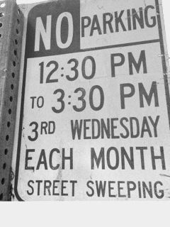
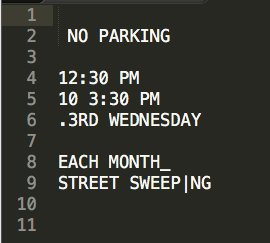

####Tesseract is an OCR (Optical Character Recognition) engine that was originally developed at Hewlett-Packard Laboratories, but has been sponsered and improved by Google since 2006.

###Basic setup
To implement tesseract with node, Leptonica needs to be install prior to configuration. Tesseract cannot be compiled without Leptonica. To install Leptonica, simply run `brew install leptonica`

After that, install tesseract globally by running `brew install tesseract`

If you don't have Homebrew installed, you can install Tesseract using MacPorts by running `sudo port install tesseract`

If you need the engine to recognize a different language other than English, you need to specify which language you need by running `sudo port install tesseract-<languagecode> || brew install tesseract-<languagecode>`
Without specifying a language code, by default it will only install the package for English recognition.

Besides global installation for local server development, to install the OCR engine for node, you need to run `npm install node-tesseract` to include as a node-module.

####Now, on to the implementation

First off, unless you use browserify to require the module on the frontend, all of the magic will happen on the backend.

You can simply require in a node file by typing,

    var tesseract = require('node-tesseract');

There are several methods that are attached to the 'tesseract' variable at this point, but to tell the engine to process the image, the only method you need to use is the `.process(path, callback)`, which takes in the path to the image file and a callback.

Here is an example from the documentation:

    tesseract.process(__dirname + '/path/to/image.jpg',function(err, text) {
      if(err) {
        console.error(err);
      } else {
        console.log(text);
      }
    });

As you can see, the implementation of the engine is quite simple depending on the usage and the need of a precise character recognition.

This is a small tip that I figured out on my own, but if your implementation of the engine is having trouble recognizing the right text, you have to consider two things. Was the text in the photo handwritten? If not, is the photo fully colored?

If the text was handwritten, the engine will have trouble processing it because it can only recognize about 40 different fonts.

If the photo is fully colored, you need to filter the photo to be monochrome (black and white), which then will allow the engine to recognize the text more easily.

Here is the result that I got

